# Flowchart: @vidabot_generator_bot

## Clone Difficulty

| Metric | Value |
|--------|-------|
| Difficulty Score | 7/10 |
| Estimated Dev Hours | 104h |
| Input Flows | 7 |
| URL Buttons | 6 |
| Async Backend | Yes (AI generation) |

## Architecture

```mermaid
graph TD
    N1["/start"]
    N2["🖼️ Buat Gambar Model"]
    N1 --> N2
    N3["🎬 Buat Video"]
    N1 --> N3
    N4["🎬 Shortcut: Image to Video"]
    N1 --> N4
    N5["🛠️ Tools Lain"]
    N1 --> N5
    N6["🖼️ Buat Gambar Model > 🔙 Kembali ke Menu"]
    N2 --> N6
    N7["🎬 Buat Video > 🖼️📱 Image Portrait"]
    N3 --> N7
    N8[/"🎬 Buat Video > 🖼️🖥️ Image Landscape\n[WAITING_IMAGE]"/]
    N3 --> N8
    N9[/"🎬 Buat Video > 📝📱 Text Portrait\n[WAITING_TEXT]"/]
    N3 --> N9
    N10[/"🎬 Buat Video > 📝🖥️ Text Landscape\n[WAITING_TEXT]"/]
    N3 --> N10
    N11[/"🎬 Shortcut: Image to Video > 📱 Portrait \n[WAITING_TEXT]"/]
    N4 --> N11
    N12[/"🎬 Shortcut: Image to Video > 🖥️ Landscap\n[WAITING_IMAGE]"/]
    N4 --> N12
    N13[/"🛠️ Tools Lain > 🖼️ Convert Gambar ke JPG\n[WAITING_IMAGE]"/]
    N5 --> N13
    N14[/"🛠️ Tools Lain > ◀️ Kembali ke Menu\n[WAITING_IMAGE]"/]
    N5 --> N14
    N15>"🎨 Buat Bahan UGC Linsync - AISTUDIO"]
    N5 -.-> N15
    N16>"✨ UGC Lipsync - Baru - Ringan"]
    N5 -.-> N16
```

