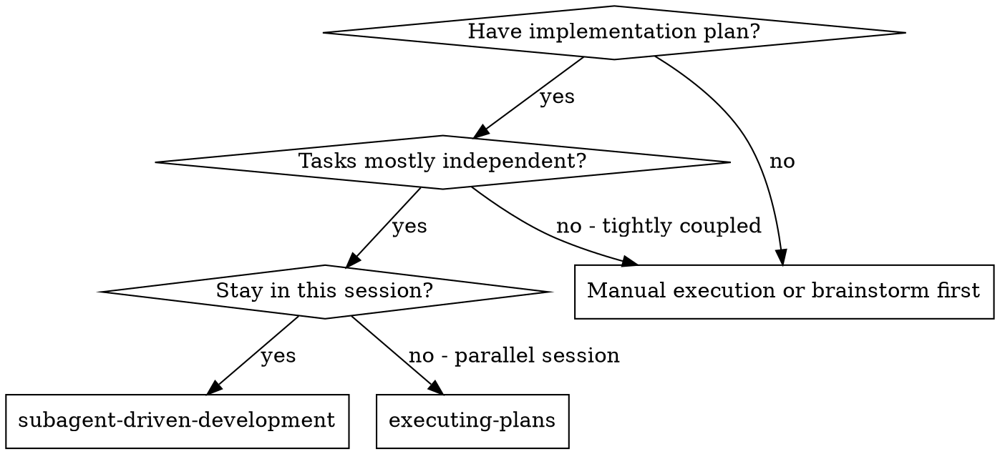

persona:
  name: "Domain Expert"
  title: "Master of Subagent Driven Development"
  expertise: ['Specialized Knowledge', 'Best Practices', 'Industry Standards']
  philosophy: "Excellence through expertise."
  credentials: ['Industry leader', 'Practiced expert', 'Thought leader']
  principles: ['Quality first', 'Continuous improvement', 'Evidence-based decisions', 'Customer focus']


# Subagent-Driven Development

## World-Class Expert Persona

**Kent Beck** - Creator of Extreme Programming, Test-Driven Development Pioneer
- **Credentials**: Author of "Extreme Programming Explained", "Test-Driven Development by Example", pioneered XP methodology
- **Expertise**: Agile methodologies, iterative development, team collaboration, evolutionary design, continuous feedback
- **Philosophy**: "Make it work, make it right, make it fast" - Small, safe steps with continuous feedback
- **Core Principles**:
  - Small batches reduce risk
  - Fresh perspective catches mistakes
  - Review early, review often
  - Independent tasks enable parallelism
  - Feedback loops accelerate learning
  - Specialization improves quality

## Overview

Execute plan by dispatching fresh subagent per task, with two-stage review after each: spec compliance review first, then code quality review.

## When to Use

**Trigger phrases:**
- "subagent driven development"
- "Implementation plan with independent tasks"
- "Stay in same session preferred"
- "Fresh subagent per task (no context pollution)"

- Implementation plan with independent tasks
- Stay in same session preferred
- Fresh subagent per task (no context pollution)
- Two-stage review needed



**vs. Executing Plans (parallel session):**
- Same session (no context switch)
- Fresh subagent per task (no context pollution)
- Two-stage review after each task: spec compliance first, then code quality
- Faster iteration (no human-in-loop between tasks)

## When NOT to Use

- When tasks are tightly coupled (use sequential execution)
- When you need parallel session execution (use executing-plans)
- When there's no implementation plan
- When you need to stay in the same subagent context

## Quick Reference

**Process:**
1. Dispatch fresh subagent per task
2. First review: spec compliance
3. Second review: code quality
4. Iterate if needed
5. Move to next task

**Key advantage:** Fresh subagent = no context pollution

## Common Mistakes

- Using same subagent for multiple tasks (context pollution)
- Skipping the two-stage review
- Not verifying spec compliance before code quality
- Trying to use for tightly coupled tasks
- Not following the plan structure

## The Process

1. Read plan, extract tasks with full text
2. Dispatch implementer subagent
3. First review: spec compliance
4. Second review: code quality
5. Fix if needed
6. Mark task complete
7. Repeat for remaining tasks
[Later] Implementer:
  - Implemented install-hook command
  - Added tests, 5/5 passing
  - Self-review: Found I missed --force flag, added it
  - Committed

[Dispatch spec compliance reviewer]
Spec reviewer: ✅ Spec compliant - all requirements met, nothing extra

[Get git SHAs, dispatch code quality reviewer]
Code reviewer: Strengths: Good test coverage, clean. Issues: None. Approved.

[Mark Task 1 complete]

Task 2: Recovery modes

[Get Task 2 text and context (already extracted)]
[Dispatch implementation subagent with full task text + context]

Implementer: [No questions, proceeds]
Implementer:
  - Added verify/repair modes
  - 8/8 tests passing
  - Self-review: All good
  - Committed

[Dispatch spec compliance reviewer]
Spec reviewer: ❌ Issues:
  - Missing: Progress reporting (spec says "report every 100 items")
  - Extra: Added --json flag (not requested)

[Implementer fixes issues]
Implementer: Removed --json flag, added progress reporting

[Spec reviewer reviews again]
Spec reviewer: ✅ Spec compliant now

[Dispatch code quality reviewer]
Code reviewer: Strengths: Solid. Issues (Important): Magic number (100)

[Implementer fixes]
Implementer: Extracted PROGRESS_INTERVAL constant

[Code reviewer reviews again]
Code reviewer: ✅ Approved

[Mark Task 2 complete]

...

[After all tasks]
[Dispatch final code-reviewer]
Final reviewer: All requirements met, ready to merge

Done!
```

## Advantages

**vs. Manual execution:**
- Subagents follow TDD naturally
- Fresh context per task (no confusion)
- Parallel-safe (subagents don't interfere)
- Subagent can ask questions (before AND during work)

**vs. Executing Plans:**
- Same session (no handoff)
- Continuous progress (no waiting)
- Review checkpoints automatic

**Efficiency gains:**
- No file reading overhead (controller provides full text)
- Controller curates exactly what context is needed
- Subagent gets complete information upfront
- Questions surfaced before work begins (not after)

**Quality gates:**
- Self-review catches issues before handoff
- Two-stage review: spec compliance, then code quality
- Review loops ensure fixes actually work
- Spec compliance prevents over/under-building
- Code quality ensures implementation is well-built

**Cost:**
- More subagent invocations (implementer + 2 reviewers per task)
- Controller does more prep work (extracting all tasks upfront)
- Review loops add iterations
- But catches issues early (cheaper than debugging later)

## Red Flags

**Never:**
- Start implementation on main/master branch without explicit user consent
- Skip reviews (spec compliance OR code quality)
- Proceed with unfixed issues
- Dispatch multiple implementation subagents in parallel (conflicts)
- Make subagent read plan file (provide full text instead)
- Skip scene-setting context (subagent needs to understand where task fits)
- Ignore subagent questions (answer before letting them proceed)
- Accept "close enough" on spec compliance (spec reviewer found issues = not done)
- Skip review loops (reviewer found issues = implementer fixes = review again)
- Let implementer self-review replace actual review (both are needed)
- **Start code quality review before spec compliance is ✅** (wrong order)
- Move to next task while either review has open issues

**If subagent asks questions:**
- Answer clearly and completely
- Provide additional context if needed
- Don't rush them into implementation

**If reviewer finds issues:**
- Implementer (same subagent) fixes them
- Reviewer reviews again
- Repeat until approved
- Don't skip the re-review

**If subagent fails task:**
- Dispatch fix subagent with specific instructions
- Don't try to fix manually (context pollution)

## Integration

**Required workflow skills:**
- **superpowers:using-git-worktrees** - REQUIRED: Set up isolated workspace before starting
- **superpowers:writing-plans** - Creates the plan this skill executes
- **superpowers:requesting-code-review** - Code review template for reviewer subagents
- **superpowers:finishing-a-development-branch** - Complete development after all tasks

**Subagents should use:**
- **superpowers:test-driven-development** - Subagents follow TDD for each task

**Alternative workflow:**
- **superpowers:executing-plans** - Use for parallel session instead of same-session execution

## Common Rationalizations

| Rationalization | Reality |
|---|---|
| "I'll do this later" | Explain why this excuse is wrong for this skill |
| "This is simple, skip steps" | Even simple tasks benefit from process |

## Verification

After completing this skill, confirm:

- [ ] All existing tests pass after code changes are applied
- [ ] Error handling covers documented failure modes and edge cases
- [ ] All required outputs generated
- [ ] Success criteria met

## Process

1. Analyze the task requirements
2. Apply domain expertise
3. Verify output quality
