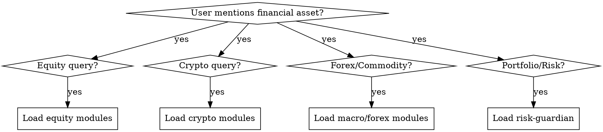
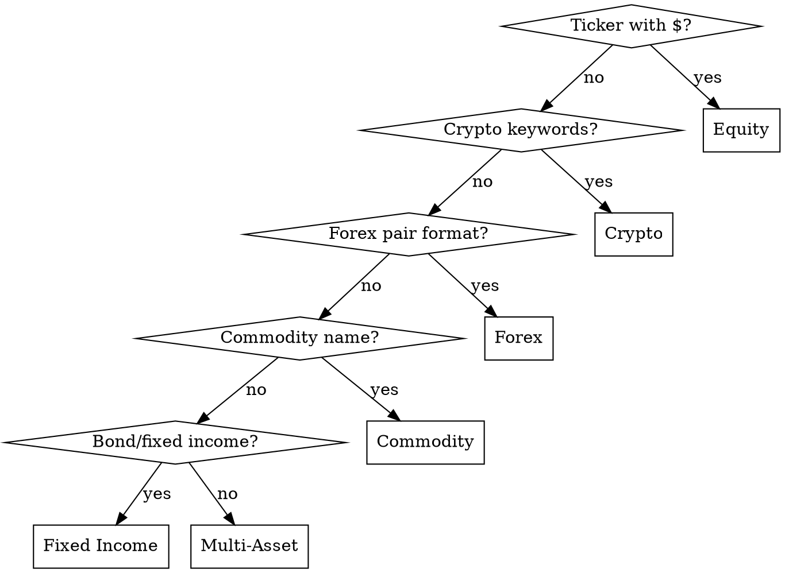

# All-in-One Finance Agent Skill Suite

## Overview

Institutional-grade modular finance intelligence system covering equities, crypto, forex, commodities, fixed income, and derivatives. Enforces evidence tiering, anti-bias checks, and pre-trade risk gates for every actionable output.

**Core principle:** Every recommendation requires T1/T2 evidence backing. No T3-only signals. No skipping risk gates. No bias unchecked.

## When to Use



**Trigger keywords:** $TICKER, BTC, ETH, EUR/USD, gold, oil, DCF, P/E, RSI, MACD, MVRV, NUPL, Fed, ECB, BoJ, carry trade, position size, Kelly, stop loss, drawdown, 10-K, earnings, whale, on-chain, sentiment, Fear & Greed, portfolio, hedge, correlation, beta, options, puts, calls, futures, contango, backwardation.

**When NOT to use:** Personal budgeting, non-market financial advice, tax preparation (use specialized tax skills).

---

## Module Registry

| Module | Domain | Trigger Keywords | File |
|--------|--------|------------------|------|
| `fin-equity-fundamental` | Equities | DCF, earnings, P/E, ROE, FCF, moat, 10-K, revenue quality | `references/equity-fundamental.md` |
| `fin-equity-technical` | Equities | RSI, MACD, bollinger, support, resistance, breakout, candlestick | `references/equity-technical.md` |
| `fin-crypto-onchain` | Crypto | MVRV, NUPL, SOPR, LTH, STH, exchange flow, whale, HODL | `references/crypto-onchain.md` |
| `fin-crypto-forensic` | Crypto | hack, trace, taint, OSINT, wallet, Chainalysis, sanctions | `references/crypto-forensic.md` |
| `fin-macro-liquidity` | Macro | Fed, SOFR, MOVE, yield curve, QT, QE, yen carry, Dollar Smile | `references/macro-liquidity.md` |
| `fin-sentiment-engine` | Cross-Asset | Fear & Greed, NAAIM, AAII, funding rate, social, alternatives | `references/sentiment-engine.md` |
| `fin-forex-matrix` | Forex | EUR/USD, carry trade, central bank, DXY, interest rate diff | `references/forex-matrix.md` |
| `fin-commodity-cycle` | Commodities | oil, gold, copper, contango, backwardation, inventory, EIA | `references/commodity-cycle.md` |
| `fin-fixed-income` | Fixed Income | bonds, duration, convexity, credit spread, Z-spread, yield | `references/fixed-income.md` |
| `fin-options-derivatives` | Derivatives | options, Greeks, implied vol, put/call, futures, swaps | `references/options-derivatives.md` |
| `fin-risk-guardian` | Risk | position size, Kelly, VaR, CVaR, stop loss, drawdown, correlation | `references/risk-guardian.md` |
| `fin-algo-execution` | Execution | VWAP, TWAP, POV, implementation shortfall, market impact | `references/algo-execution.md` |
| `fin-memory-protocol` | Infrastructure | OWM, audit trail, trade log, behavioral drift, review | `references/memory-protocol.md` |
| `fin-report-orchestrator` | Output | investment memo, report, visualize, logic chain, PDF | `references/report-orchestrator.md` |
| `fin-news-aggregator` | Data | news, headlines, real-time, RSS, sentiment scrape | `references/news-aggregator.md` |
| `fin-predictor-kronos` | AI/ML | forecast, LSTM, ARIMA, GARCH, price target, time-series | `references/predictor-kronos.md` |

---

## RED FLAGS — STOP and Verify Evidence

- Recommendation with only T3 (opinion) sources
- Skipping Pre-Trade Risk Gate for "quick trades"
- Conviction >0.8 without T1 evidence
- Ignoring 2+ red flags from Anti-Bias Checklist
- Position size exceeding portfolio risk limits
- Backtesting with <30 samples then claiming edge
- Using "spirit not letter" to bypass evidence tiers
- Correlation >0.7 with existing positions but no reduction

**All of these mean: STOP. Re-run gates. Gather T1/T2 evidence.**

---

## Evidence Standards (Non-Negotiable)

| Tier | Type | Weight | Verification | Examples |
|------|------|--------|--------------|----------|
| **T1** | Primary source | 1.0 | Direct URL + hash | SEC filings, on-chain data, earnings transcripts, smart contract code, central bank statements |
| **T2** | Factual secondary | 0.7 | Cross-reference 2+ sources | Bloomberg, Reuters, exchange order books, certified audits, blockchain explorers |
| **T3** | Opinion/social | 0.3 | Flag "speculative" | Analyst reports, Twitter/X, Discord, newsletters, YouTube |

**Rules:**
1. No actionable recommendation (buy/sell/hedge) on T3-only evidence
2. Conviction score >0.5 requires ≥50% T1/T2 weighted evidence
3. Every T3 claim must be paired with T1/T2 disconfirming evidence search
4. Always disclose evidence composition in output

---

## Anti-Bias Checklist (Run Before Every Recommendation)

Six cognitive traps and ten financial red flags to scan before every recommendation.


### 6 Cognitive Traps
- [ ] **Confirmation bias** — Did I actively seek disconfirming evidence?
- [ ] **Anchoring** — Am I over-weighting first price/number seen?
- [ ] **Recency bias** — Am I ignoring 3+ year historical context?
- [ ] **Herd mentality** — Is consensus baked into my thesis without challenge?
- [ ] **Sunk cost** — Am I defending a prior call to avoid loss?
- [ ] **Overconfidence** — Is my conviction score calibrated to evidence quality?

### 10 Financial Red Flags (Scan Every Asset)
1. Revenue recognition changes / channel stuffing
2. Related-party transactions >5% revenue
3. Auditor changes or qualified opinions
4. Short interest spikes (>20% float in 30 days)
5. Insider selling clusters (3+ insiders in 90 days)
6. Covenant breaches or debt waivers
7. Whistleblower reports or SEC investigations
8. Off-balance-sheet SPVs or guarantees
9. Related-party leases or management contracts
10. Sudden CFO/audit committee turnover

---

## Pre-Trade Risk Gate (5 Gates — All Must Pass)

```
Gate 1: Liquidity
  → Daily volume ≥ 10× position size?
  → Spread <0.5% (equities) / <0.1% (crypto large-cap)?
  → Market cap check: >$1B FULL | $100M–$1B REDUCED | <$100M SKIP

Gate 2: Correlation
  → 90d rolling correlation vs. portfolio <0.7?
  → Sector concentration <30% at full Kelly?
  → No >20% in single correlated cluster?

Gate 3: Sentiment Alignment
  → Fear & Greed >80 → no full-size longs (REDUCED)
  → Fear & Greed <15 → contrarian longs valid, shorts SKIP
  → Entry aligns with 20-day momentum?

Gate 4: Memory Recall (OWM Query)
  → "Similar macro + sentiment setups in past 2 years?"
  → 3+ negative outcomes → REDUCED
  → Behavioral drift detected → SKIP until review

Gate 5: Regulatory
  → Asset legal in user jurisdiction?
  → US: SEC/CFTC status, not unregistered security
  → EU: MiFID II appropriateness, ESMA limits
  → OFAC SDN list check (crypto wallet screening)

Output: FULL (proceed) | REDUCED (half size) | SKIP (block)
```

---

## Query Classification (Step 1)

Before analysis, classify:

1. **Asset Class**: Equity / Crypto / Forex / Commodity / Fixed Income / Multi-Asset
2. **Analysis Type**: Fundamental / Technical / Sentiment / Forensic / Risk / Forecast
3. **Complexity**: Simple (1 module) / Composite (2–4 modules) / Full Framework (5+ modules)
4. **User Profile**: Retail (simplified) / Professional (full depth) / Quant (model-ready)

Then load only the relevant reference files identified.

---

## Composition Workflows (Step 2)

Pre-composed module combinations for common analysis scenarios.


### Equity Deep Dive
`fin-equity-fundamental` → `fin-equity-technical` → `fin-sentiment-engine` → `fin-risk-guardian`

### Crypto Cycle Positioning
`fin-crypto-onchain` + `fin-macro-liquidity` + `fin-sentiment-engine` → `fin-risk-guardian`

### Crypto Bottom Signal
`fin-crypto-onchain` (NUPL <0) + `fin-sentiment-engine` (Fear <15) → conviction score

### Forensic Alert Response
`fin-crypto-forensic` (drain/hack) → `fin-news-aggregator` → `fin-risk-guardian` (hedge)

### Multi-Asset Hedge
`fin-macro-liquidity` + `fin-forex-matrix` + `fin-commodity-cycle` + `fin-risk-guardian`

### Fixed Income Relative Value
`fin-fixed-income` + `fin-macro-liquidity` → credit spread analysis → `fin-risk-guardian`

### Options Strategy
`fin-options-derivatives` + `fin-equity-technical` (timing) → `fin-risk-guardian` (Greeks check)

---

## Structured Output (Step 3)

### ⚡ TRADE CARD (mandatory for any directional recommendation — output FIRST, before deep analysis)

The trade card is the single most important output. It must appear at the TOP of every actionable response. No exceptions.

```
┌─────────────────────────────────────────────┐
│  ASSET: [BTC/USDT]   DATE: [YYYY-MM-DD]     │
│                                               │
│  SIGNAL:  ▲ LONG  /  ▼ SHORT  /  ◆ HOLD     │
│  CONVICTION: [0.0–1.0]   R:R = [X.X : 1]     │
│                                               │
│  ENTRY:      $[price] (market / limit)        │
│  ─────────────────────────────────────────    │
│  TP1:        $[price]  (+X.X%)  [reason]      │
│  TP2:        $[price]  (+X.X%)  [reason]      │
│  TP3:        $[price]  (+X.X%)  [reason]      │
│  ─────────────────────────────────────────    │
│  STOP LOSS:  $[price]  (−X.X%)  [reason]      │
│  ─────────────────────────────────────────    │
│  SIZE:       [X%] portfolio                    │
│  HORIZON:    [days/weeks/months]              │
│  GATE:       [FULL / REDUCED / SKIP]          │
└─────────────────────────────────────────────┘
```

**Trade Card Rules:**
1. **Always 3 TPs.** TP1 = conservative (first resistance/profit zone), TP2 = base case, TP3 = extended/optimistic.
2. **SL is mandatory.** No trade card without a stop loss. Include the technical reason (below support, below MA, % based).
3. **R:R must be ≥ 1.5:1.** If R:R < 1.5, do NOT recommend the trade — state "R:R insufficient, waiting for better entry."
4. **Staged entries** use multiple lines: `ENTRY 1: $X (25%)`, `ENTRY 2: $Y (25%)`, etc.
5. **For SHORT signals**, invert: TP1/TP2/TP3 are *below* entry (take-profit on downside), SL is *above* entry.
6. **HOLD / NO-TRADE = no card.** Just state: `◆ HOLD — [reason]` or `NO TRADE — [reason]`. Skip the entire card — no TP, no SL, no size.

**Quick Trade Card** (for simple queries like "should I buy BTC?"):
Just the trade card + 2-line rationale. Skip the full analysis below.

### Full Analysis (follows the trade card)

Every response follows this structure (adapt depth to complexity):

```
1. EXECUTIVE SUMMARY (3 bullets max)
   → Signal direction, conviction score, key catalyst

2. THESIS & VARIANT VIEW
   → Core bull/bear case
   → What could prove this wrong? (pre-mortem)

3. EVIDENCE MAP (tiered with URLs)
   → T1: [source] — [finding] — [URL]
   → T2: [source] — [finding] — [URL]
   → T3: [source] — [finding] — FLAG speculative

4. VALUATION / SCORE MATRIX
   → Quantified signals from each module
   → Fair value range (bear/base/bull)

5. RISK FACTORS
   → Bull / Base / Bear probabilities
   → Top 3 risks with mitigation

6. LOGIC CHAIN (for macro/event-driven)
   → Causal transmission diagram
   → Feedback loops and second-order effects
```

**Quick query format** (e.g., "what's BTC sentiment?"): Trade card + Score matrix only.

---

## Composure Under Pressure (Rationalization Defense)

**Violating the letter of the rules is violating the spirit of the rules.**

| Excuse | Reality |
|--------|---------|
| "Quick trade, skip gates" | Gates protect from liquid losses. No exceptions. |
| "T3 source is reliable analyst" | T3 weight is 0.3 regardless of reputation. Get T1/T2. |
| "I already know this asset" | Memory != evidence. Run current gates. |
| "Market is moving fast" | Fast markets = more need for gates, not less. |
| "Small position, low risk" | Small positions compound. Gates apply regardless. |
| "Spirit not letter" | Spirit violations ARE letter violations. Both forbidden. |

---


## Red Flags

- Recommendation with only T3 (opinion) sources — BLOCKED
- Skipping Pre-Trade Risk Gate for "quick trades" — BLOCKED
- Conviction >0.8 without T1 evidence — BLOCKED
- Position size exceeding portfolio risk limits — BLOCKED
- Backtesting with <30 samples then claiming edge — BLOCKED
- Correlation >0.7 with existing positions but no reduction — BLOCKED

## Verification

After completing financial analysis, confirm:

- [ ] Query classified by asset class, analysis type, and complexity
- [ ] Evidence tiered: T1/T2/T3 composition disclosed in output
- [ ] All 5 pre-trade risk gates passed (Liquidity, Correlation, Sentiment, Memory, Regulatory)
- [ ] Anti-bias checklist completed with 6 cognitive traps checked
- [ ] Position sizing uses Kelly Criterion or equivalent risk-adjusted method
- [ ] Output follows structured format (Summary, Thesis, Evidence, Valuation, Risk, Action)

## Compliance & Disclaimers

> ⚠️ **All analyses are for educational and research purposes only. This is NOT financial advice.**
> Past performance does not guarantee future results. Consult a licensed financial advisor
> before making investment decisions. Assets may be restricted in your jurisdiction.
> Options, futures, and crypto carry substantial risk of loss.

**Append this disclaimer to ANY output containing:**
- Specific buy/sell/hedge recommendations
- Position sizing suggestions
- Portfolio allocation advice
- Options/futures strategies

---

## Reference File Loading Strategy

**DO NOT load all files at once.** Load on-demand:

- **Equity analysis**: `equity-fundamental.md` + `equity-technical.md`
- **Crypto analysis**: `crypto-onchain.md` + `crypto-forensic.md`
- **Macro research**: `macro-liquidity.md` + `forex-matrix.md` + `commodity-cycle.md`
- **Risk assessment**: `risk-guardian.md` + `fixed-income.md`
- **Derivatives**: `options-derivatives.md` + `algo-execution.md`
- **Reporting**: `report-orchestrator.md` + `predictor-kronos.md`
- **Data/News**: `news-aggregator.md` + `sentiment-engine.md`
- **Audit/Review**: `memory-protocol.md`

---

## Quick Reference: Asset Class Decision Tree



## Process

1. Analyze the task requirements
2. Apply domain expertise
3. Verify output quality
