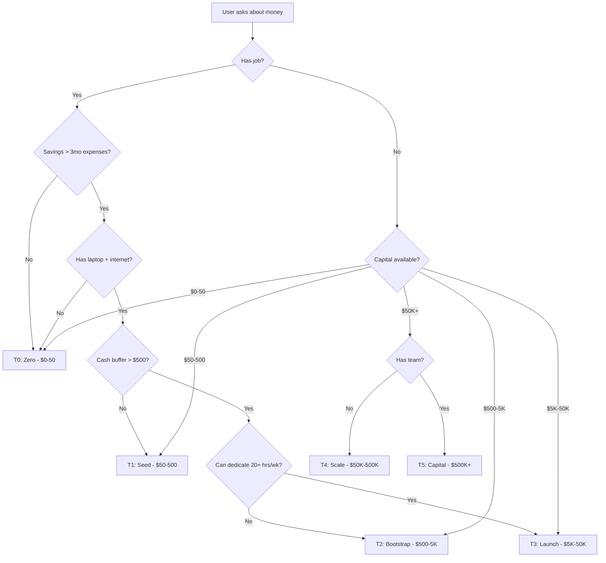
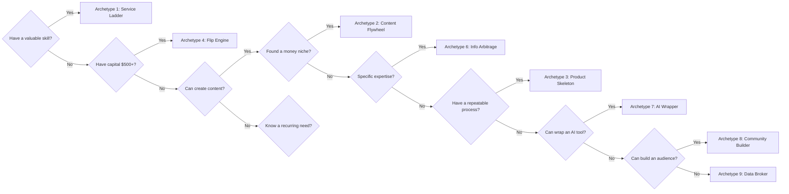

## When to Use

**Trigger phrases:**
- "critical thinking"
- "make money", "print money", "income", "side hustle", "passive income"
- "What should I do to make money?"
- "How do I start with no money?"
- "Evaluate this business idea"
- "How to scale my current income"
- "arbitrage", "flipping", "flip", "SaaS", "agency"
- "Should I do X or Y?"
- "Is this opportunity legit?"

**Situations:**
- Evaluating business proposals or income-generating opportunities
- Analyzing whether a money-making strategy is viable
- Debugging why a business or income stream isn't working
- Choosing between multiple paths based on capital, time, and skills
- Distinguishing real opportunities from get-rich-quick traps
- Deciding when to kill a failing strategy

## When NOT to Use

- Gut-feel or rapid decisions that don't need analysis (use heuristics)
- Creative ideation where judgment blocks ideas (use brainstorming)
- Situations where professional financial advising is legally required
- When the user explicitly wants emotional support, not strategy

## Overview

Diagnose your starting position, evaluate every opportunity by expected value, and execute proven income-generating strategies. This skill gives you the mental frameworks to cut through noise, avoid cognitive traps, and commit to actions that actually move the needle — no hype, no theory, just systematic judgment.

## Dependencies

- None required — this is a mental framework, not a toolchain

## Core Principles

- **Start with the starting point** — Your capital, time, and skills determine what's accessible. Never prescribe above the user's tier.
- **Value before money** — Money follows value delivered. Identify the value first, the money will map to it.
- **Execute before perfect** — A decent plan executed today beats a perfect plan next month. First action in <30 min.
- **Proof before scale** — Validate with one real transaction before building systems, hiring, or spending on ads.
- **Leverage compounds** — Labor → Code/Content → Capital. Each stage multiplies the output of the previous one.
- **Track objectively** — Measure time-to-cash, margin, and RAEV. If the numbers don't work, don't do it.

## Cognitive Biases in Money-Making

| Bias | How It Costs You Money | Countermeasure |
|------|----------------------|----------------|
| **Optimism bias** | Overestimate probability of success | Cut estimated probability in half |
| **Sunk cost fallacy** | Keep pouring time into failing idea | Ask: "Would I start this today?" If no, stop. |
| **Shiny object syndrome** | Jump between strategies, never execute one | Commit to one archetype for 90 days |
| **Dunning-Kruger** | Don't know what you don't know | Find someone who's done it before and ask hard questions |
| **Loss aversion** | Avoid small risks that have positive EV | Calculate RAEV; if positive, take the shot |
| **Confirmation bias** | Only see evidence that supports your idea | Actively argue the opposite case before committing |
| **Status quo bias** | Stay in a situation that isn't working | Calculate the cost of inaction over 1 year |
| **Anchoring** | Base decisions on an irrelevant reference number | Research 3 independent data points before setting price/expectation |
| **Overconfidence effect** | Overestimate your own skill vs. reality | Log your predictions; measure calibration score monthly |

# Critical Thinking → Money Printing

## Core Premise

Critical thinking is the meta-skill that powers every money-making method. This skill embeds economic reasoning, opportunity evaluation, and execution strategy into every critical thought. When invoked, the agent **does not ask questions** — it diagnoses the user's starting point, maps it to proven strategies, and prescribes the path.

**Money is a score-keeping mechanism for value delivery.** The question is never "how do I make money?" — it's "what value can I deliver, to whom, at what margin, with what leverage?"

---

## Diagnosis: Starting Point Mapping

Before any recommendation, classify the user's position:

| Tier | Capital | Time Available | Typical Starting Point | Strategy |
|------|---------|----------------|----------------------|----------|
| **T0: Zero** | $0–50 | Full-time | No savings, no tools | Arbitrage your labor and attention |
| **T1: Seed** | $50–500 | Evenings/weekends | Has a laptop, internet | Micro-services, flipping, content |
| **T2: Bootstrap** | $500–$5K | Part-time flexible | Has savings buffer | Mini-inventory, paid tools, ads |
| **T3: Launch** | $5K–$50K | Dedicated | Can quit job | SaaS MVP, agency, physical goods |
| **T4: Scale** | $50K–$500K | Full-time + team | Existing business | Hiring, automation, acquisition |
| **T5: Capital** | $500K+ | Strategic | Investment portfolio | Arbitrage, market-making, equity |

**Rule**: The agent never asks "what's your situation." It infers from available signals or states the range of strategies for each plausible tier.



---

## The Money-Making Frameworks

### Framework 1: ROI Waterfall (Evaluate Any Opportunity)

Rate every money-making opportunity on these criteria in order:

1. **Time-to-Cash** — How many hours before first dollar? (<1h = A, <1wk = B, <1mo = C, >1mo = D)
2. **Margin** — Net profit per unit of effort (High/Medium/Low/Negative)
3. **Scalability** — Can this ×10 without ×10 effort? (Product/System/People/None)
4. **Defensibility** — How long until competition destroys margin? (Moat/Brand/Head-start/None)
5. **Capital Efficiency** — $ returned per $1 invested (>10x, 3-10x, 1-3x, <1x)
6. **Personal Fit** — Does this use existing skills? (Native/Adjacent/New/Unrelated)

**Decision rule**: Any opportunity scoring D on Time-to-Cash OR Negative margin is discarded immediately. Remaining opportunities are ranked by (Margin × Scalability × Capital Efficiency).

**Scoring system**: Assign 1-5 for each criterion, multiply: `Score = TTC × Margin × Scalability × CapitalEff × Fit`. Discard < 50. Target > 150.

### Framework 2: The Leverage Stack

Money scales proportionally to leverage applied. There are exactly four forms:

| Leverage | How it prints money | Example |
|----------|-------------------|---------|
| **Labor** | Sell your time | Freelancing, consulting, services |
| **Code** | Sell software once, sell infinitely | SaaS, tools, automation |
| **Content** | Create once, attract forever | Courses, writing, video |
| **Capital** | Money makes money | Interest, dividends, equity |

**Critical thinking rule**: Evaluate which leverage the user has access to NOW, and which they can BUILD next. Never recommend a code play to someone who can't code unless the build step is part of the plan.

### Framework 3: Arbitrage Detection Engine

Money exists in gaps. Train the agent to detect:

- **Geographic arbitrage**: Buy where cheap, sell where expensive
- **Temporal arbitrage**: Buy when low (off-season, distressed), sell when high
- **Skill arbitrage**: Do what others can't for those who won't learn
- **Information arbitrage**: Know something others don't (yet)
- **Platform arbitrage**: Exploit new platforms before attention arbitrage closes
- **Status arbitrage**: Sell prestige to the aspiring, utility to the busy
- **Regulatory arbitrage**: Operate where rules favor you

**Algorithm**: For every gap identified, compute: Gap Size × Speed to Exploit × Duration Until Closure. If product > 1, execute.

**Example**: A new AI video tool launches with a generous free tier (Platform arbitrage). You create faceless YouTube channels using it before the masses arrive. Gap = large (free compute), Speed = fast (already know prompting), Duration = 3-6 months until paid tier. Score: 8/10 × 8/10 × 5/10 = 0.32. Execute.

### Framework 4: Time-to-Cash Matrix

| Revenue Speed | Low Effort | Medium Effort | High Effort |
|--------------|-----------|---------------|-------------|
| **<1 day** | Flipping, gig work | Direct service | High-ticket sales |
| **<1 week** | Affiliate, templates | Consulting mini-engagement | Physical product flipping |
| **<1 month** | Info product, print-on-demand | Software tool | Agency setup |
| **<6 months** | Course, membership | SaaS beta | Inventory business |
| **<1 year** | Platform building | Marketplace | Manufacturing |

**Rule**: Time-to-cash must match the user's runway. No runway = must pick from row 1 or 2 only.

### Framework 5: Risk-Adjusted Expected Value (RAEV)

```
RAEV = (Profit_if_success × Probability) - (Loss_if_fail × Probability_fail) - Opportunity_Cost
```

Where `Probability_fail = 1 - Probability`.

**Threshold**: RAEV must be positive AND higher than the next best alternative. If not, don't do it.

**Calibration**: Adjust Probability downward by 50% for any claim the user hasn't personally validated.

**Working Python calculator** — save as `rae_calc.py` and run with `python3 rae_calc.py`:

```python
#!/usr/bin/env python3
"""RAEV Calculator — Risk-Adjusted Expected Value for money-making decisions."""

def raev(profit_success: float, prob_success: float,
         loss_fail: float, opportunity_cost: float = 0.0,
         name: str = "Opportunity") -> float:
    """Compute Risk-Adjusted Expected Value.
    
    Args:
        profit_success: Net profit if successful
        prob_success: Probability of success (0.0-1.0)
        loss_fail: Loss if fails (positive number)
        opportunity_cost: Value of next best alternative
        name: Label for display
        
    Returns:
        RAEV value. Positive = worth considering.
    """
    prob_fail = 1.0 - prob_success
    ev = (profit_success * prob_success) - (loss_fail * prob_fail) - opportunity_cost
    
    print(f"\n{'='*50}")
    print(f"  {name}")
    print(f"{'='*50}")
    print(f"  Profit if success:    ${profit_success:>10,.2f}")
    print(f"  Probability success:  {prob_success:>13.1%}")
    print(f"  Loss if fail:         ${loss_fail:>10,.2f}")
    print(f"  Probability fail:     {prob_fail:>13.1%}")
    print(f"  Opportunity cost:     ${opportunity_cost:>10,.2f}")
    print(f"  {'─'*46}")
    print(f"  RAEV:                 ${ev:>10,.2f}")
    print(f"  Verdict:              {'✅ TAKE IT' if ev > 0 else '❌ SKIP IT'}")
    print(f"{'='*50}\n")
    return ev

def compare_opportunities(opps: list[dict]) -> None:
    """Compare multiple opportunities and rank by RAEV."""
    results = []
    for opp in opps:
        ev = raev(
            profit_success=opp['profit'],
            prob_success=opp['prob'],
            loss_fail=opp['loss'],
            opportunity_cost=opp.get('cost', 0),
            name=opp['name']
        )
        results.append((ev, opp['name']))
    
    results.sort(reverse=True)
    print("\n🏆 RANKING (best first):")
    for i, (ev, name) in enumerate(results, 1):
        print(f"  {i}. {name}: ${ev:>8,.2f}")

if __name__ == "__main__":
    # Example: Compare 3 side hustles
    compare_opportunities([
        {"name": "Freelance dev", "profit": 5000, "prob": 0.6, "loss": 200, "cost": 1000},
        {"name": "Flip electronics", "profit": 800, "prob": 0.8, "loss": 300, "cost": 0},
        {"name": "SaaS side project", "profit": 24000, "prob": 0.15, "loss": 2000, "cost": 3000},
    ])
```

### Framework 6: Opportunity Cost Analysis

Every hour and dollar spent on one path is denied to every other path. Compute the true cost:

```
Opportunity_Cost = Best_Alternative_RAEV - Chosen_Path_RAEV

If Opportunity_Cost > 0 AND the gap is > 20% of Chosen_Path_RAEV:
    → Reconsider: the alternative is strictly better
```

**Quick table for common tradeoffs**:

| Choice | What you sacrifice | Breakeven calculation |
|--------|-------------------|----------------------|
| Build SaaS instead of freelance | $X/hr you could earn freelancing | MRR must exceed freelance rate × hours spent |
| Learn a new skill vs. use existing | Time-to-cash delay of 3-6 months | New skill must yield 2x income to justify delay |
| Bootstrap vs. raise funding | Equity + control | Bootstrap RAEV must be < 50% of funded RAEV to justify dilution |
| Quit job vs. keep it | $Salary per month of runway burned | Side project must reach $Salary/mo within 6 months |

### Framework 7: Capital Scaling Path

Every strategy must answer: "How does this get to the next tier?"

| Current Tier | Next Tier Milestone | Proven Path |
|-------------|--------------------|-------------|
| T0 → T1 | $50 saved from labor arbitrage | Gig stacking: 3 services × $20/hr × 10hr/wk = $600/mo |
| T1 → T2 | $500 profit from first product | Flip 5 items at $100 margin each, or sell 10 micro-services |
| T2 → T3 | $5K recurring revenue | Mini-SaaS at $50/mo × 100 customers, or agency retainers |
| T3 → T4 | $50K ARR | SaaS scaling to 500 customers, or agency to 5-figure monthly |
| T4 → T5 | $500K revenue | Hiring first employees, automation, systematic marketing |
| T5+ | Million+ | Capital deployment, acquisition, market-making |

---

## Archetype Selection Flowchart



---

## Proven Money-Printing Archetypes

### Archetype 1: The Service Ladder

**How it prints**: Sell a deliverable result. Starts as time-for-money, graduates to system-for-money.

**Path**:
1. Identify a painful problem a specific business type has (bookkeeping, lead gen, content, tech support)
2. Offer to solve it for $X/outcome (not per hour)
3. Deliver manually, document every step
4. Build SOPs → hire sub-contractors → collect spread
5. Package the system as a SaaS or course

**Critical thinking check**: Is this problem urgent enough that they'd pay today? Test with one cold email before building anything.

**Validation method**: "I'll do this for 3 clients for free in exchange for a testimonial." If you can't find 3, the problem isn't real.

**Skill integration**: Pair with `cold-email`, `b2b-sales-automation`, `ai-lead-generation`, `email-sequences`.

### Archetype 2: The Content Flywheel

**How it prints**: Create valuable information once. It attracts attention. Convert attention to money.

**Path**:
1. Pick a niche where people spend money (not just "interested in")
2. Create content that solves a specific problem in that niche
3. Build audience on 1-2 platforms (don't spread thin)
4. Monetize via: affiliate for tools you use, info-product for your method, consulting for your expertise

**Critical thinking check**: Is the niche economically active? Check: Are there existing paid products? Are people searching for solutions? Is the ad cost in this niche > $1/click? Yes = money.

**Platform priority**: Where is your audience underserved? Go there first.

### Archetype 3: The Product Skeleton

**How it prints**: Build something once that delivers value repeatedly without your time.

**Path**:
1. Identify a process you do repeatedly for yourself or others
2. Ask: can this be automated, templated, or packaged?
3. Build the minimal version (landing page + basic delivery)
4. Charge for it immediately (day 1 — not after "polishing")
5. Improve based on who actually pays

**Critical thinking check**: Would I use this? Would someone I know pay for it? If both no, drop it.

**Best first products**: Templates, checklists, spreadsheets, simple web tools, Notion setups, automation scripts.

### Archetype 4: The Flip Engine

**How it prints**: Buy underpriced, sell at market. The most primitive and reliable form.

**Path**:
1. Identify a liquid market (FB Marketplace, eBay, Craigslist, specialized forums)
2. Find distressed sellers (moving, divorce, death, need cash, don't know value)
3. Buy at 30-50% of market value
4. Clean/photograph/list properly
5. Sell at 80-100% of market value

**Critical thinking check**: What's the spread after fees and time? If net margin < 20%, skip. What's the velocity? Items sitting >30 days are inventory rot.

**Niches that print**: Luxury goods (watches, bags), tools (power, automotive), electronics (Apple, ThinkPads), collectibles (Pokémon, sneakers, LEGO).

### Archetype 5: The Pipeline (Recurring Revenue)

**How it prints**: One sale = revenue every month until cancelled.

**Path**:
1. Identify a recurring need (hosting, backup, cleaning, reporting, compliance, training)
2. Package as a subscription
3. Sell on value of convenience/peace-of-mind vs DIY cost
4. Focus on retention over acquisition (churn kills pipelines)

**Critical thinking check**: What's the real churn rate in this niche? If >10%/month, the math doesn't work unless margins are >90%. Calculate LTV:CAC ratio — needs to be >3:1.

**LTV:CAC formula**: `LTV = ARPU / Churn_Rate`. `CAC = Total_Sales_Cost / New_Customers`. Ratio must exceed 3:1 for a healthy business.

### Archetype 6: The Info Arbitrage

**How it prints**: Know something valuable that others don't. Sell the knowledge.

**Path**:
1. Find a domain where you have unique knowledge (industry, skill, experience)
2. Find people who need that knowledge to make money or avoid losing it
3. Package as a report, guide, course, or consulting
4. Price at 10x the value delivered (if it saves them $1K, charge $100)

**Critical thinking check**: Is the knowledge actually valuable? Would someone pay for it today? The price is set by the value to the buyer, not the effort to produce.

### Archetype 7: The AI Wrapper

**How it prints**: Wrap a powerful AI tool with a thin layer of configuration, domain knowledge, and delivery. Charge for the result, not the API call.

**Path**:
1. Identify a manual process that AI can augment (editing, research, analysis, content, coding)
2. Build a prompt chain, template, or simple interface around the AI
3. Offer it as a service (not a tool — sell the outcome)
4. Deliver faster/cheaper than manual alternatives
5. Scale by standardizing inputs and automating delivery

**Critical thinking check**: Is the AI output good enough to ship without human review? If no, this is still a service business, not a product. Price accordingly.

**Examples that work**: AI content editing for agencies, AI research reports for investors, AI code review for startups, AI data extraction for e-commerce.

**Skill integration**: Pair with `prompt-engineering`, `rag-builder`, `omniroute-integration`, `ai-saas-builder`.

### Archetype 8: The Community Builder

**How it prints**: Gather people with a common interest or problem. Monetize access, connections, and curated value.

**Path**:
1. Identify a group that lacks a quality community (founders, traders, devs in niche language, local business owners)
2. Create a free MVP (Discord, Slack, Telegram) with daily value
3. Reach critical mass (100+ active members)
4. Add premium tier: exclusive content, expert AMAs, job board, deal flow
5. Scale through member referral and sponsored content

**Critical thinking check**: Do these people already pay for something in this space? If no existing paid communities exist, the willingness to pay is unproven.

**Revenue models**: $10-50/mo membership, $500-5K sponsored posts, $100-1K event tickets, affiliate deals.

### Archetype 9: The Data Broker

**How it prints**: Collect, organize, and sell information that others need but won't compile themselves.

**Path**:
1. Find a domain where scattered information is valuable when aggregated (real estate comps, supplier lists, pricing data, competitor intelligence)
2. Build a scraper or manual collection pipeline
3. Clean, normalize, and enrich the data
4. Sell as a spreadsheet, API, dashboard, or report
5. Update regularly to create recurring revenue

**Critical thinking check**: Is this data already available for free somewhere in one place? If yes, you have no margin. If it's scattered across 100 sources, you have a business.

**Examples that work**: Local business contact lists, e-commerce pricing databases, job market salary compilations, real estate comparables.

---

## Case Studies

### Case 1: Service Ladder — From $0 to $3K/mo in 8 weeks

**Person**: Generalist with no specific skills beyond internet research.
**Start**: T0 ($50 in bank, laptop, full-time available).

**Strategy**: Offered "competitor research reports" to local SaaS founders. Cold-emailed 20 founders with a one-page sample report on their top competitor. 3 replied, 1 paid $500 for a full report. Delivered in 3 days. Used the report as a case study to get 2 more clients at $500 each. Within 8 weeks: 6 clients at $500/mo retainer for monthly competitive intelligence. Hired a VA at $300/mo to do the research. Net: $2,700/mo.

**RAEV at start**: ($500 profit × 0.3 prob) - ($0 loss × 0.7) - $0 = $150 positive. Take it.

### Case 2: Flip Engine — $200 → $4,600 in 45 days

**Person**: Knew nothing about luxury goods.
**Start**: T1 ($200 capital).

**Strategy**: Scoured FB Marketplace for "antique" and "vintage" jewelry listed under $50. Researched markings/ stamps on Google Lens. Found a 14k gold ring listed for $40 — seller thought it was costume. Bought, cleaned, sold to a gold buyer for $180. Reinvested. After 45 days: 12 flips, average margin $383, total profit $4,600.

**Critical check**: Net margin 61%. Velocity: 3.75 days per item. No holding cost. Scale constraint: sourcing effort.

### Case 3: AI Wrapper — $0 to $8K/mo in 3 months

**Person**: Freelance writer with basic coding knowledge.
**Start**: T2 ($2K savings).

**Strategy**: Noticed e-commerce stores needed hundreds of product descriptions. Built a Python script that: (1) scraped product data from CSV upload, (2) generated SEO-optimized descriptions via GPT, (3) output formatted HTML. Charged $0.50/description vs. $5/manual. First client: 2,000 descriptions = $1,000. Referred to 5 more stores. Within 3 months: automated pipeline processing 50K descriptions/mo at $8K revenue. Time per order: 15 min setup. Margin: 90%.

**RAEV**: ($8K/mo × 0.4) - ($500 build cost × 1.0) - $0 = $2,700/mo RAEV. Clear take.

### Case 4: Content Flywheel — $0 to $15K/mo in 6 months

**Person**: No content experience, but knew Excel/Google Sheets deeply.
**Start**: T1 ($200).

**Strategy**: Started a TikTok/YouTube Shorts channel teaching "Excel tricks that save hours." Posted 1 video/day for 60 days. At 30 days: 2K followers, zero revenue. At 60 days: 15K followers, launched a $27 "Excel Automation Template Pack" — sold 43 copies ($1,161). At 90 days: 50K followers, launched a $197 course — 22 sales ($4,334). At 6 months: 200K followers, course + templates + affiliate ($15K/mo).

**Critical check**: Month 1 looked like failure (zero revenue). The flywheel needs a critical mass of content before it spins. The niche passed the spending test: businesses pay for Excel training (existing $500 workshops, $30 books).

---

## Execution Protocol (No Asking, Only Doing)

When this skill is activated, the agent executes this protocol:

### Step 0: Kill the Bad Ideas First

Apply these deal-breakers before any analysis. If ANY match, discard immediately:

| Deal-breaker | Test | Example |
|-------------|------|---------|
| **Negative unit economics** | Does the math work on one unit? | Selling $10 items with $8 shipping + $3 platform fee = -$1 |
| **No existing demand** | Are people already paying for this? | If zero competitors exist, zero demand (usually) |
| **Requires permission** | Can you start today without anyone's approval? | Needing a license, approval, or partnership to start |
| **Passive income promise** | Does the pitch promise "set and forget"? | All passive income is deferred effort |
| **Upfront fee to earn** | Are you asked to pay to access the opportunity? | MLM entry fees, course-to-sell-their-course, "investment opportunities" |
| **Regulatory gray area** | Could this get shut down or fined? | Unregistered securities, unlicensed services, copyright violation |
| **No clear customer** | Who writes the check? | "Everyone needs this" = no one specifically needs this |

### Step 1: Diagnose Starting Point
Infer the user's tier from available context. If ambiguous, present the tier grid and map all strategies for each plausible tier.

### Step 2: Apply ROI Waterfall to Available Archetypes
For each archetype accessible at the user's tier, score:
- Time-to-cash
- Margin
- Scalability
- Personal fit

Rank them. Discard negative-RAEV options.

### Step 3: Prescribe the Top 3 Paths
For each:
- **Exact first action** (tweet, listing, email, code commit)
- **Time estimate to first dollar**
- **Capital required**
- **Risk factors and mitigation**

### Step 4: Provide the First Action Script
Literally what to do in the next 30 minutes. Not "research the market" — "go to FB Marketplace, search 'table saw', filter by price < $100, message 5 listings with 'is this still available?'"

---

## Exit / Stop Criteria

When to kill a strategy. Hard metrics, not feelings:

| Scenario | Stop signal | Action |
|----------|-------------|--------|
| **Service** | No paid client after 30 cold outreaches | Problem isn't painful enough. Pivot niche or archetype. |
| **Content** | < 100 followers after 60 daily posts | Wrong platform or niche. Try different format or topic. |
| **Flipping** | < 20% margin after fees on 5 consecutive flips | Wrong category or pricing strategy. Switch vertical. |
| **Product** | Zero paid users after 3 months of iteration | Problem isn't real or solution isn't good enough. Kill. |
| **Pipeline** | Churn > 10%/month after 20 customers | Product-market-fit. Fix retention or pivot. |
| **Info product** | Zero sales after 100 targeted visitors | Price, positioning, or traffic source wrong. A/B test price point. |

**The 90-day rule**: Pick one archetype. Execute for 90 days. If after 90 days the time-to-cash trajectory is not clearly positive, kill it without regret. Sunk cost is not a reason to continue.

---

## Weekly Execution Cadence

| Week | T0-T1 (Zero/Seed) | T2-T3 (Bootstrap/Launch) | T4-T5 (Scale/Capital) |
|------|-------------------|-------------------------|----------------------|
| 1 | Pick archetype, do first action | Validate 3 customer problems | Audit existing ops for inefficiency |
| 2 | Do 10 cold outreaches | Build MVP / first listing | Delegate one process |
| 3 | Get first $20+ | First paying customer($) | Hire first VA/contractor |
| 4 | Document what worked | Measure margins, adjust pricing | Set up systems & tracking |
| 5 | Double down on channel | Double customer acquisition | Optimize for margins, not revenue |
| 6 | Add second channel | Build SOPs for delivery | Review unit economics |
| 7 | Track time-to-cash metric | Test price increase (+20%) | Fire worst-performing channel |
| 8 | Re-invest 50% of profit | Hire first help / automate | Strategic planning session |
| 9 | Stack to next tier | Test scaling channel | Run acquisition / partnership |
| 10 | Review: keep, pivot, kill | Re-invest 40% profit | Review portfolio allocation |
| 11-12 | Next archetype or double | Launch v2 / expansion | Quarterly strategy refresh |

---

## Verification Checklist

- [ ] Starting point diagnosed (inferred or tier-grid presented)
- [ ] ROI Waterfall applied to ≥3 archetypes
- [ ] Risk-adjusted expected value calculated
- [ ] Archetype matches leverage available to user
- [ ] Time-to-cash compatible with user's runway
- [ ] Deal-breaker check passed (Step 0)
- [ ] Exit criteria defined for the chosen path
- [ ] First action is concrete and actionable in <30 min
- [ ] Capital path to next tier defined
- [ ] No questions asked — analysis and prescription delivered

---

## Anti-Rationalization Table

| Rationalization | Reality |
|-------|---------|
| "I need a perfect idea first" | Execution beats ideas. Pick any viable engine and start. |
| "I need more money to start" | All tier-0 strategies require $0. |
| "The market is saturated" | Saturation means proven demand. Differentiation wins, not novelty. |
| "I'll build it and they'll come" | Marketing is not optional. Budget time for distribution. |
| "I need to quit my job first" | Job = runway. Build the engine while employed. |
| "It's too late for X" | New money is made every day in every market. |
| "I'm not qualified" | The market pays for results, not credentials. |
| "Passive income is easy" | There is no passive income. There is deferred effort. |
| "More features = more sales" | Customers buy solutions, not features. Strip to essentials. |
| "I'll start after I finish X" | There will always be another X. Start today. |

---

## Skill Integration Map

| Archetype | Primary Skills | Supporting Skills |
|-----------|--------------|-------------------|
| Service Ladder | `b2b-sales-automation`, `cold-email` | `ai-lead-generation`, `email-sequences`, `negotiation-mastery` |
| Content Flywheel | `viral-content-creator`, `social-intelligence` | `seo-auditor`, `ai-seo`, `multi-platform-distribution` |
| Product Skeleton | `ai-saas-builder`, `product-market-fit` | `pricing-strategy`, `landing-page-common-bugfixes` |
| Flip Engine | `price-tracker`, `opportunity-exploitation` | `competitive-strategy`, `arbitrage` (specialized) |
| Pipeline | `payment-integration`, `churn-prevention` | `email-marketing`, `customer-success` |
| Info Arbitrage | `market-research`, `mckinsey-research` | `content-creator`, `pdf-creator`, `pitch-deck` |
| AI Wrapper | `prompt-engineering`, `ai-saas-builder` | `omniroute-integration`, `rag-builder`, `model-router` |
| Community Builder | `social-media-engagement`, `discord` | `influencer-outreach`, `referral-program` |
| Data Broker | `smart-scraper`, `data-pipeline-engine` | `bigquery-integration`, `analysis` |

---

## The Commitment Table

| If you do this | This happens | Timeframe |
|----------------|-------------|-----------|
| Ship one service offering to 10 prospects | First sale (some win rate > 0) | <2 weeks |
| Create content daily for 60 days | First organic customer | 60-90 days |
| Flip 10 items at 30% margin | $300-$3K depending on category | <30 days |
| Build one micro-SaaS and charge for it | $0-$1K MRR if you solve a real problem | 30-90 days |
| Stack 3 gig-economy platforms | $500-$2K/mo additional income | Immediate |
| Package your skill into a template/tool | $100-$5K/mo passive (if marketed) | 30 days build, ongoing |
| Cold email 100 prospects in a niche | $2K-$10K in services revenue | 30-60 days |
| Build one AI wrapper + list on a marketplace | $500-$5K/mo (if solves real pain) | 7-14 days build |

---

## Commands

```bash
# Quick-start: diagnose your starting position
# Tier 1 (<$1K): gig platforms + flipping
# Tier 2 ($1-10K drops): services + cold email
# Tier 3 ($10-100K drops): micro-SaaS + content flywheel
# Tier 4 (100K+): info products + arbitrage + community

# Evaluate any opportunity by expected value
# EV = (success_prob * success_value) - (failure_prob * failure_cost)
# If EV < 0 or payback > 90 days → pass
```

---

*This skill transforms critical thinking from theory into a money-printing engine. The frameworks above are proven across thousands of operators. The only variable is execution.*
