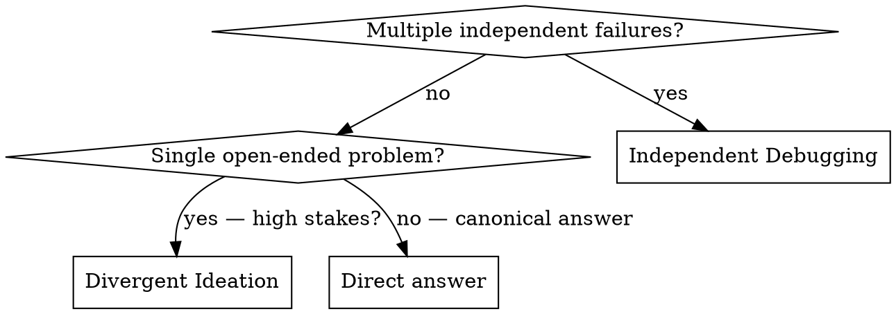

persona:
  name: "Domain Expert"
  title: "Master of Dispatching Parallel Agents"
  expertise: ['Specialized Knowledge', 'Best Practices', 'Industry Standards']
  philosophy: "Excellence through expertise."
  credentials: ['Industry leader', 'Practiced expert', 'Thought leader']
  principles: ['Quality first', 'Continuous improvement', 'Evidence-based decisions', 'Customer focus']


# Dispatching Parallel Agents

## Overview

Parallel agent dispatch solves a common bottleneck: when multiple independent problems need solving, investigating them one at a time wastes time. This skill covers two patterns:

1. **Independent Debugging** — Split unrelated failures across agents (different files, different subsystems)
2. **Divergent Ideation** — Attack the *same* problem from multiple cognitive angles to escape premature convergence

Both use the same core mechanism (parallel isolated agent calls) but for fundamentally different purposes.

**Core principle:** Dispatch one agent per independent unit of work. Let them run concurrently without shared context.

---

## Anti-Rationalization Table

| Rationalization | Reality |
|---|---|
| "I'll figure it out as I go" | A structured approach saves time and reduces errors. Follow the workflow in this skill rather than improvising. |
| "I already know this topic" | Familiarity breeds shortcuts. Use the checklist to verify you haven't missed critical steps. |
| "This doesn't apply to my situation" | The patterns here generalize across contexts. Adapt, don't skip — the underlying principles hold. |
| "One more tool will fix it" | Adding complexity rarely solves process gaps. Master the core workflow first. |

## When to Use

**Trigger phrases:**
- "dispatching parallel agents"
- "3+ test files failing with different root causes"
- "Multiple subsystems broken independently"
- "Each problem can be understood without context from others"
- "/adhd", "brainstorm this", "give me a few ways to"
- "think outside the box on this"

### Decision Tree



**Use Pattern 1 (Independent Debugging) when:**
- 3+ test files failing with different root causes
- Multiple subsystems broken independently
- Each problem can be understood without context from others
- No shared state between investigations

**Use Pattern 2 (Divergent Ideation) when:**
- Architecture decisions where the obvious answer may not be best
- API/SDK surface design (naming, ergonomics, tradeoffs)
- Fuzzy debugging with no known root cause
- Open-ended strategy or positioning
- Schema / data model design

**Don't use either when:**
- Failures are related (fix one might fix others)
- Syntax lookups or bugs with known root cause
- Low-stakes decisions
- User says "quick", "standard", "canonical", "textbook", or "just"

---

## Pattern 1 — Independent Debugging

Split unrelated failures across parallel agents, each owning one problem domain.


### 1. Identify Independent Domains

Group failures by what's broken:
- File A tests: Tool approval flow
- File B tests: Batch completion behavior
- File C tests: Abort functionality

Each domain is independent - fixing tool approval doesn't affect abort tests.

### 2. Create Focused Agent Tasks

Each agent gets:
- **Specific scope:** One test file or subsystem
- **Clear goal:** Make these tests pass
- **Constraints:** Don't change other code
- **Expected output:** Summary of what you found and fixed

### 3. Dispatch in Parallel

```typescript
// In Claude Code / AI environment
Task("Fix agent-tool-abort.test.ts failures")
Task("Fix batch-completion-behavior.test.ts failures")
Task("Fix tool-approval-race-conditions.test.ts failures")
// All three run concurrently
```

### 4. Review and Integrate

When agents return:
- Read each summary
- Verify fixes don't conflict
- Run full test suite
- Integrate all changes

---

## Pattern 2 — Divergent Ideation

Attack the *same* problem from multiple cognitive angles to escape premature convergence. Instead of splitting by problem domain, split by *cognitive frame* — every agent gets the same problem but a different vantage prompt.

This is expensive (~10 agent calls per run). Use a pre-flight gate first.

### Pre-Flight Gate

**Step 1. Explicit invocation check.** If the user typed `/adhd` or explicitly asked for "brainstorm", "divergent ideation", or "parallel frames", skip the rest of this gate and proceed directly.

**Step 2. Self-judge.** Ask three questions. If any answer is no, ABORT and answer directly.

1. **Open-ended?** Would a senior engineer give multiple viable answers here, or is there one canonical answer?
2. **High-stakes?** Is the cost of the obvious answer being wrong actually high? Architecture, public APIs, product naming, fuzzy bugs = yes.
3. **Open phrasing?** Did the user avoid words like "quick", "standard", "canonical", "textbook", "just"?

### Phase 1 — Diverge (no critic)

1. **Pick 5 cognitive frames** from the table below. Bias toward engineering tags for code problems. Always include at least one wild frame.

2. **Spawn 5 parallel isolated branches.** Each branch gets only:
   - The problem P
   - Any context the user provided
   - The chosen frame's vantage prompt
   - A system instruction forbidding evaluation

   ```
   You are in DIVERGENT mode — a generator, not a critic.
   Generate 6 short distinct ideas under this frame. Each idea is one
   phrase or one sentence. Do not evaluate. Do not rank. Do not hedge.
   The first three obvious answers everyone would give are banned.
   Push past them into the awkward middle.
   Output JSON only: [{"text": "...", "rationale": "..."}, ...]
   ```

3. **Critical invariant:** Branches must be parallel and isolated. Do NOT serialize. Do NOT pass one branch's output to another. Branches that see each other anchor each other, and the whole method collapses to a wider single thought.

### Phase 2 — Focus (critic on)

1. **Score.** Rate each idea 0–10 on: **Novelty** (distance from obvious), **Viability** (could it ship), **Fit** (addresses the problem). Flag traps with a one-line reason.

2. **Cluster.** Group into 3–6 clusters by underlying angle. Label by angle: "remove-the-server plays", "cache-shaped plays".

3. **Deepen the top 3.** Rank by weighted score (Novelty 0.35 + Viability 0.40 + Fit 0.25), exclude traps. For each, produce:
   - 4–8 sentence sketch
   - The load-bearing risk
   - The first concrete step a builder would take
   - 3–5 child ideas (variations, hybrids, unlocks)

   ```
   You are in FOCUS mode. Take one promising idea and connect dots.
   Sketch how it would actually work in 4–8 sentences. Name the
   load-bearing risk. Name the first concrete step a coder would take.
   Then generate 3–5 sub-ideas that branch off.
   Output JSON only.
   ```

### Cognitive Frames

Pick 5 per run. For code problems: 4 tagged `code`/`design` + 1 tagged `wild`.

| Frame | Vantage Prompt | Tags |
|-------|---------------|------|
| **hardware engineer** | You think in latency, memory layout, and physical constraints. Re-ask this as a hardware/firmware problem. What does the bus topology, cache, timing budget tell you? | code, wild |
| **regulator** | You audit systems for compliance and failure modes. What must be provable, traceable, or refusable here? | design, general |
| **10-year-old** | You are a curious 10 year old who has never seen software. Describe naive but unencumbered approaches. Ignore convention. | general, wild |
| **competitor trying to break it** | You are a hostile competitor or attacker. Generate approaches that exploit, fail, or sabotage the obvious solution. Then invert into ideas. | code, design |
| **biology** | Transplant a mechanism from biology (immune systems, neural plasticity, cell signaling, evolution, gut flora). Force-fit it onto this engineering problem. | code, wild |
| **logistics** | Steal mechanisms from logistics: queues, batching, just-in-time, hub-and-spoke, returns, last-mile. Apply them literally. | code, design |
| **game design** | Approach this as a game designer. What are the loops, rewards, friction, save-states, speedrun tricks? Treat the user as a player. | design, general |
| **markets** | Treat the problem as a market. Buyers, sellers, market-makers. What does an auction, a futures contract, a clearing house look like here? | design, wild |
| **inversion** | Ask the OPPOSITE question. If goal is X, brainstorm how to guarantee NOT X. Then negate each answer back. | code, design, general |
| **extreme: $0 budget, 1 hour** | No money, no team, one hour. What is the crudest version that still does the load-bearing thing? | code, general |
| **extreme: infinite budget, 10 years** | Infinite compute, infinite engineers, a decade. What is the maximalist version? | design, wild |
| **remove the load-bearing assumption** | Name the thing everyone treats as fixed (framework, database, request-response model, network). Imagine it is gone. What is possible? | code, design, wild |
| **speedrunner** | You are a speedrunner. Find glitches, skips, out-of-bounds tricks, frame-perfect shortcuts. What is the abusive-but-legal path? | code, wild |
| **ant colony** | No central planner. Many dumb agents, local rules, pheromone trails. How does the problem solve itself emergently? | code, wild |
| **3am on-call** | You are the on-call engineer woken at 3am when this breaks. What design would let you not get paged? | code, design |

### Output Shape

Render in this order. Structure is the point — do not collapse into prose.

1. **Brief.** One–two lines confirming the problem and any reframe used.
2. **Wide set.** Full pool grouped by cluster. Show score chips: `[N7 V8 F9]` per idea.
3. **Converge.** 2–4 idea shortlist. Mark non-obvious pick with ★. List traps with one-line reasons.
4. **Focus.** 3 deepened branches: sketch, risk, first step, child ideas.
5. **Provocation.** One wildcard question/idea if nothing landed.

### Calibration

| Context | Frames × Ideas | Total |
|---------|---------------|-------|
| Quick naming decision | 3 × 4 | ~12 |
| Default | 5 × 6 | ~30 |
| High-stakes strategy | 5 × 8 | ~40 |

### Divergent Ideation Anti-Patterns

| Anti-pattern | Fix |
|-------------|-----|
| Convergence disguised as divergence | If every candidate shares one assumption, you decorated, not diverged. |
| Weird-for-weird's-sake with no convergence | Always converge. Structure is half the value. |
| Walls of equally-weighted prose | Cluster, label, pull out the best. |
| Refusing to commit | Take a position. Generate wide, converge with an opinion. |
| Skipping the isolation invariant | Branches must be in fresh contexts. Sequential = wider single thought, not divergent. |

---

## Agent Prompt Structure

Good agent prompts are:
1. **Focused** - One clear problem domain
2. **Self-contained** - All context needed to understand the problem
3. **Specific about output** - What should the agent return?

```markdown
Fix the 3 failing tests in src/agents/agent-tool-abort.test.ts:

1. "should abort tool with partial output capture" - expects 'interrupted at' in message
2. "should handle mixed completed and aborted tools" - fast tool aborted instead of completed
3. "should properly track pendingToolCount" - expects 3 results but gets 0

These are timing/race condition issues. Your task:

1. Read the test file and understand what each test verifies
2. Identify root cause - timing issues or actual bugs?
3. Fix by:
   - Replacing arbitrary timeouts with event-based waiting
   - Fixing bugs in abort implementation if found
   - Adjusting test expectations if testing changed behavior

Do NOT just increase timeouts - find the real issue.

Return: Summary of what you found and what you fixed.
```

## Common Mistakes

**❌ Too broad:** "Fix all the tests" - agent gets lost
**✅ Specific:** "Fix agent-tool-abort.test.ts" - focused scope

**❌ No context:** "Fix the race condition" - agent doesn't know where
**✅ Context:** Paste the error messages and test names

**❌ No constraints:** Agent might refactor everything
**✅ Constraints:** "Do NOT change production code" or "Fix tests only"

**❌ Vague output:** "Fix it" - you don't know what changed
**✅ Specific:** "Return summary of root cause and changes"

## When NOT to Use

**Related failures:** Fixing one might fix others - investigate together first
**Need full context:** Understanding requires seeing entire system
**Exploratory debugging:** You don't know what's broken yet
**Shared state:** Agents would interfere (editing same files, using same resources)

## Real Example from Session

**Scenario:** 6 test failures across 3 files after major refactoring

**Failures:**
- agent-tool-abort.test.ts: 3 failures (timing issues)
- batch-completion-behavior.test.ts: 2 failures (tools not executing)
- tool-approval-race-conditions.test.ts: 1 failure (execution count = 0)

**Decision:** Independent domains - abort logic separate from batch completion separate from race conditions

**Dispatch:**
```
Agent 1 → Fix agent-tool-abort.test.ts
Agent 2 → Fix batch-completion-behavior.test.ts
Agent 3 → Fix tool-approval-race-conditions.test.ts
```

**Results:**
- Agent 1: Replaced timeouts with event-based waiting
- Agent 2: Fixed event structure bug (threadId in wrong place)
- Agent 3: Added wait for async tool execution to complete

**Integration:** All fixes independent, no conflicts, full suite green

**Time saved:** 3 problems solved in parallel vs sequentially

## Key Benefits

1. **Parallelization** - Multiple investigations happen simultaneously
2. **Focus** - Each agent has narrow scope, less context to track
3. **Independence** - Agents don't interfere with each other
4. **Speed** - 3 problems solved in time of 1

## Verification

After agents return:
1. **Review each summary** - Understand what changed
2. **Check for conflicts** - Did agents edit same code?
3. **Run full suite** - Verify all fixes work together
4. **Spot check** - Agents can make systematic errors

## Real-World Impact

From debugging session (2025-10-03):
- 6 failures across 3 files
- 3 agents dispatched in parallel
- All investigations completed concurrently
- All fixes integrated successfully
- Zero conflicts between agent changes

## Quick Reference

- Use when: 3+ independent failures, different subsystems, no shared state
- Don't use when: Failures related, need full context, exploratory
- Dispatch one agent per problem domain
- Each agent needs: specific scope, clear goal, constraints, expected output
- After return: Review summaries, check conflicts, run full suite

## Common Rationalizations

| Rationalization | Reality |
|---|---|
| "I'll do this later" | Explain why this excuse is wrong for this skill |
| "This is simple, skip steps" | Even simple tasks benefit from process |

## Red Flags

- Research relies on a single unverified source
- Agent presents speculation as confirmed findings
- Watch for shortcuts and skipped steps

## Process

1. Analyze the task requirements
2. Apply domain expertise
3. Verify output quality
